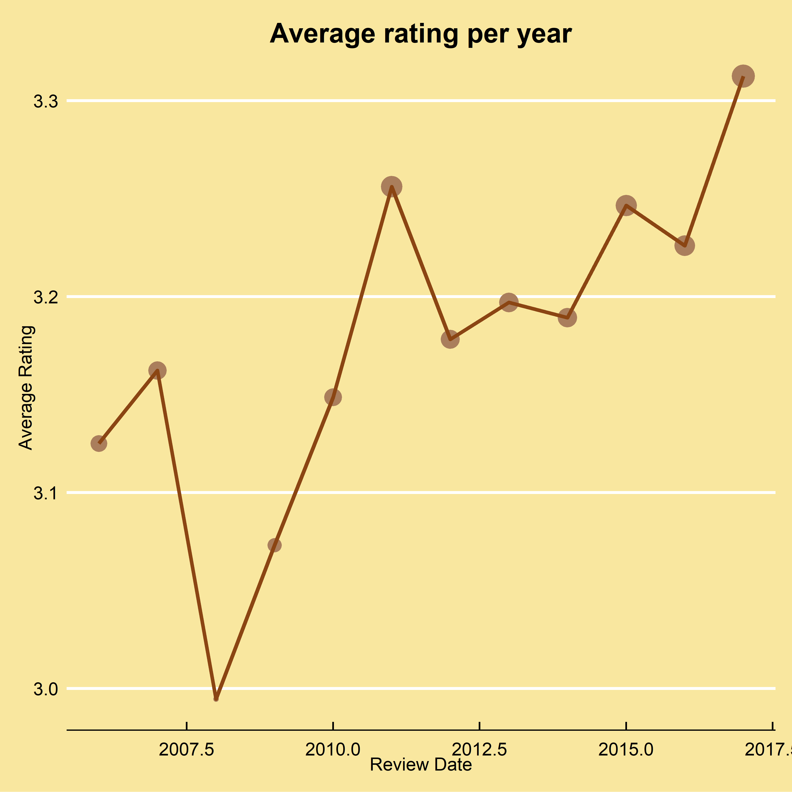

# &nbsp;&nbsp;&nbsp;&nbsp;Chocolately analysis

Chocolate is a beloved sweet, all around the world. Who doesn't love chocolate right? In this project we will analysing the chocolate dataset using the statistical programming language R. We happen to be lovers of both chocolate and R, so this is a sweet treat for us.

# &nbsp;&nbsp;&nbsp;&nbsp;Workspace setup

When performing tests in a laboratory, all the tools needed for the tests on that particular day are brought out of storage and placed in the lab ready to go. R is no different, we need to prepare our laboratory for the tests to come.

## &nbsp;&nbsp;&nbsp;&nbsp;Packages

Packages are a compilation of functions created by third parties that extend the features of base R. Many of these packages are superfluous, but a select few have become essential. 

This project uses a lot of third party defined functions, so to make readers of our project aware of the packages that they would need to install to reproduce our results, we place all our library calls in the beginning, so that the code fails early. It also makes it easier and quicker to debug should a package be missing.


```{r Packages, comment=NULL, message=FALSE, results='hide', warning=FALSE}
pkgs <- c("ggthemes", "hrbrthemes", "htmltools", "lubridate", "tidyverse")
sapply(pkgs, function(x) if (!require(x, character.only = TRUE)) {
    install.packages(x, repos = "https://cran.mirror.ac.za/")
    require(x, character.only = TRUE)
})
```

The code above programmatically checks if a package is installed before attempting to load the package. The <code class="rfunction">require </code> function is used here instead of <code class="rfunction">library</code>. This is because <code class="rfunction">require</code> returns <code class="logical">FALSE</code> and gives a warning, whereas <code class="rfunction">library</code> throws an error. Therefore, the result of <code class="rfunction">require</code> can be used to evaluate if a package is installed, so that it can be installed if it isn't. 

## &nbsp;&nbsp;&nbsp;&nbsp;Importing data

The chocolate dataset is saved as a .csv file, which stands for comma separated values. Your file explorer might lead you to be believe that this is an excel file but it isn't! The .csv file is really a text file where variables are separated by commas. It just so happens that the default program on many systems is a spreedsheet program. 

R loves working with text files, with the base <code class="rfunction">read.csv</code> function readily available to import data into R. So let us bring in our data!

```{r Import Data, comment=NULL, message=FALSE, warning=FALSE}
chocolate <- read.csv("chocolate.csv")
```

# Data Exploration and Manipulation

The packages have been loaded and the data has been imported, time to start getting acquainted with the chocolate dataset.

We start by viewing the structure of the data.

```{r data structure, comment=NULL}
str(chocolate)
```

Then we use the <code class="rfunction">glimpse</code> function from <code class="rfunction">dplyr</code>, installed and loaded with the  <code class="rfunction">tidyverse</code>, to see some of the observations from each column. 

```{r data head, comment=NULL}
glimpse(chocolate)
```

We can see that columns with strings are of type character and columns with numbers are either of type integer or double, which is good as it means R read in the data correctly.

However, R, by no fault of its own, read in the Cocoa Percent column as a character. This is because of the percentage symbol, so it would not be a number. We can remove this using <code class="rfunction">gsub()</code> like so:

```{r remove percent, comment=NULL}
chocolate$Cocoa.Percent <- gsub("%", "", chocolate$Cocoa.Percent) %>%
  as.data.frame()%>%
  type_convert() %>% unlist()
```

Dplyr's <code class="rfunction">type_convert()</code> function guess the type of the data from the first 1000 observations and then converts the data to that type. 

Now that we've gotten a fill of the data, we can proceed with summary stats.

## Summary statistics

Summary statistics provide key facts that describe the data and central tendency. It is very easy to obtain summary statistics in R with the <code class="rfunction">summary</code> function. The <code class="rfunction">summary</code> function works best with numeric variables, so we use <code class="rfunction">select_if</code> to select numeric columns only and pass them to <code class="rfunction">summary</code>

```{r summary statistics, comment=NULL}
chocolate %>%
  select_if(is.numeric) %>%
summary(chocolate)
```


## Plotting data

<div class="prefade" id="codescatter">

```{r scatter plot code, comment=NULL, fig.show='hide', message=FALSE, results='hide', warning=FALSE}
ggplot(chocolate, aes(x= Review.Date, y = Rating, color = Cocoa.Percent)) + 
  geom_point() + 
  geom_jitter() +
  geom_smooth(method = 'lm')+
  scale_color_continuous(low = "#b69885", high = "#763411")+
  theme_economist()+
  theme(legend.key.width = unit(5, "lines"))
```

</div>

```{r save scatter plot, comment=NULL, echo=FALSE, message=FALSE, results='hide', warning=FALSE}

sctrplt <- ggplot(chocolate, aes(x= Review.Date, y = Rating, color = Cocoa.Percent)) + 
  geom_point() + 
  geom_jitter() +
  geom_smooth(method = 'lm')+
  scale_color_continuous(low = "#b69885", high = "#763411")+
  theme_economist()+
  theme(legend.key.width = unit(5, "lines"))+ 
  labs(x="Review Date", y="Rating")

png("scatterplot.png", width = 480*8, height = 480*8, res = 72*8)
sctrplt
dev.off()
```

<div class="fade fadeOut" id="scatterplot">

```{r scatter plot, dpi=600, echo=FALSE, echo=FALSE, out.width="900", out.height="550", class.output="moneyChart"}
knitr::include_graphics("scatterplot.png")
```

</div>

<div class="plotDetail" id = "scatterplotdetail">

The code above creates a scatter plot. The graph shows that reviews have become more condensed over time. Initially, the reviews were more spread out earlier on. The early years had a lot of 1 and 2 star ratings. Conversely, there hasn't been a 5 star review since 2007.

Interestingly, the cocoa percentage does not appear to have any correlation with the rating given. 

</div>

<div class="codedetail" id="geomcodedetail">

Now we will look at how the average ratings of the chocolate bars has progressed over the years. This is done with a combination of <code class="rfunction">geom_point</code> and <code class="rfunction">geom_line</code>, with the latter being used to connect the points made by the former.

</div>

<div class="prefade" id="codeline">

```{r average rating code, comment=NULL, fig.show='hide', message=FALSE, warning=FALSE}
chocolate %>%
  group_by(Review.Date) %>%
  summarise(averageRating = mean(Rating)) %>%
  ggplot(aes(y= averageRating, x = Review.Date ))+
  geom_point(color="#aa7e5c", aes(size=averageRating)) +
  geom_line(group=1, color="chocolate4", size = 1.1) + 
  theme_economist() + theme(legend.position="none", plot.title=element_text(hjust=0.5), plot.background=element_rect(fill="#F9E79F")) + 
  labs(title="Average rating per year", x="Review Date", y="Average Rating")
```

</div>

```{r save graph code, comment=NULL, echo=FALSE, fig.show='hide', message=FALSE, results='hide', warning=FALSE}
choc <- chocolate %>%
  group_by(Review.Date) %>%
  summarise(averageRating = mean(Rating)) %>%
  ggplot(aes(y= averageRating, x = Review.Date ))+
  geom_point(color="#aa7e5c", aes(size=averageRating)) +
  geom_line(group=1, color="chocolate4", size = 1.1) + 
  theme_economist() + theme(legend.position="none", plot.title=element_text(hjust=0.5), plot.background=element_rect(fill="#F9E79F")) + 
  labs(title="Average rating per year", x="Review Date", y="Average Rating")

png("chocRating.png", width = 480*8, height = 480*8, res = 72*8)
choc
dev.off()
```

<div class="fade fadeOut" id="linegraph">

```{r line graph, dpi=600, echo=FALSE, echo=FALSE, out.width="900", out.height="550"}

```

</div>

<div class="codedetail" id="linegraphdetail">

The plot shows that the average rating of chocolate bars has increased over time. Initially, the reviews dropped off steeply before increasing post 2008. The overall trend shows an uptick in ratings.

The code chunk below creates a graph that shows the distribution of ratings across the years. This is important in order to see how the ratings change over the years. 

To create the plot, we use <code class="rfunction">geom_density()</code> to create a the density plot. Then we use <code class="rfunction">facet_wrap</code> to place each individual year density plot on its own grid.

The <code class="rfunction">scale_fill_manual()</code> function is used to map custom colours to each density plot. This function is used when the specified `fill` in the `aes` call is a factor. If it was a continuous variable, we would use <code class="rfunction">scale_fill_continuous()</code>, which would require a `low` and `high` argument passed to it.

</div>

<div class="prefade" id="densitycode">

```{r code for density plots, comment=NULL, fig.show='hide', results='hide', message=FALSE, warning=FALSE}
chocolate %>%
  ggplot(aes(x = Rating, fill = as.factor(Review.Date))) + 
    geom_density(alpha = .5) + 
    theme_minimal() +
    theme(plot.title=element_text(hjust=0.5), plot.background=element_rect(fill="#F4F6F7"))+
    scale_fill_manual(values = c("#8253b7", "#89f057", "#fba31d", "#0ad7f6",
                                 "#3f4143", "#975228", "#42652f", "#cf203c",
                                 "#cf203c", "#6eb3ea", "#89f057", "#fba31d"))+
    facet_wrap(~ as.factor(Review.Date)) + 
    guides(fill = FALSE) + labs(x = 'Rating', y = 'Density')
```

</div>

```{r save densityplots, comment=NULL, echo=FALSE, message=FALSE, results='hide', warning=FALSE}
densities <- chocolate %>%
  ggplot(aes(x = Rating, fill = as.factor(Review.Date))) + 
    geom_density(alpha = .5) + 
    theme_minimal() +
    theme(plot.title=element_text(hjust=0.5), plot.background=element_rect(fill="#F4F6F7"))+
    scale_fill_manual(values = c("#8253b7", "#89f057", "#fba31d", "#0ad7f6",
                                 "#3f4143", "#975228", "#42652f", "#cf203c",
                                 "#cf203c", "#6eb3ea", "#89f057", "#fba31d"))+
    facet_wrap(~ as.factor(Review.Date)) + 
    guides(fill = FALSE) + labs(x = 'Rating', y = 'Density')


png("densityplots.png", width = 480*8, height = 480*8, res = 72*8)
densities
dev.off()
```

<div class="fade fadeOut" id="densitygraph">

```{r load densityplots, comment=NULL, dpi=600, echo=FALSE, message=FALSE, out.width="900", out.height="550", warning = FALSE}
knitr::include_graphics("densityplots.png")
```

</div>

<div class="codedetail" id="densitydetail">

The graph shows again how much the ratings change through the years. This time we can clearly see the range of ratings per year. For instance, the earlier years (2006, 2007, 2008) have a flat distribution. The later years have a much steeper distribution, showing again that the ratings have improved in recent years. 

Looking at the 2017 distribution, it is incredibly steeper than the other years, even the immediately prior years. What happened in 2017? Furthermore, does the projection in ratings mean that the quality of chocolate bars increased? 

</div>

<script src="https://ajax.googleapis.com/ajax/libs/jquery/2.1.1/jquery.min.js"></script>

<div class="prefade" id = "barcode">

```{r barchart code, comment=NULL, fig.show='hide', message=FALSE, results='hide', warning=FALSE}
chocolate %>%
  group_by(Review.Date) %>% 
  summarise(n = n()) %>%
  ggplot(aes(x=Review.Date, y=n)) + 
    geom_bar(stat='identity', fill="#cf203c",color="black") + 
    theme(plot.title=element_text(hjust=0.5))+
    labs(title = "Ratings count per year", x = "Review Date", y = "Frequency") +
    theme(aspect.ratio = 3.9/7.2,
        text = element_text(family = "Roboto Condensed"),
        plot.margin = margin(0,0,0,0),
        panel.background = element_rect(fill = "white"),
        panel.grid.major.x = element_blank(),
        panel.grid.major.y = element_line(color = "darkgrey"),
        axis.text = element_text(size = rel(1), color = "gray8"),
        axis.line.x  = element_line(color = "gray8"),
        axis.ticks.y = element_blank(),
        plot.title = element_text(size = rel(1.5), hjust = 0, face = "bold"),
        plot.caption = element_text(hjust = 0, size = 9))
```

</div>

```{r barchat save, comment=NULL, echo=FALSE, message=FALSE, results='hide', warning=FALSE}
font_rc

bars <- chocolate %>%
  group_by(Review.Date) %>% 
  summarise(n = n()) %>%
  ggplot(aes(x=Review.Date, y=n)) + 
    geom_bar(stat='identity', fill="#cf203c",color="black") + 
    theme(plot.title=element_text(hjust=0.5))+
    labs(title = "Ratings count per year", x = "Review Date", y = "Frequency") +
    theme(aspect.ratio = 3.9/7.2,
        text = element_text(family = "Roboto Condensed"),
        plot.margin = margin(0,0,0,0),
        panel.background = element_rect(fill = "white"),
        panel.grid.major.x = element_blank(),
        panel.grid.major.y = element_line(color = "darkgrey"),
        legend.text = element_text(margin = margin(l=3), size = 10),
        legend.title = element_blank(),
        legend.position = c(0.16,0.7),
        legend.key.width = unit(25,"pt"),
        legend.key.height = unit(15, "pt"),
        axis.text = element_text(size = rel(1), color = "gray8"),
        axis.line.x  = element_line(color = "gray8"),
        axis.ticks.y = element_blank(),
        plot.title = element_text(size = rel(1.5), hjust = 0, face = "bold"),
        plot.caption = element_text(hjust = 0, size = 9))

png("barchart.png", width = 480*8, height = 480*8, res = 72*8)
bars
dev.off()
```

<div class="fade fadeOut" id = "barchart">

```{r barchart load, comment=NULL, dpi=600, echo=FALSE, message=FALSE, out.height=550, out.width=900, warning=FALSE}
knitr::include_graphics("barchart.png")
```

</div>

<div class="codedetail" id = "bardetail">

So it out turns out that the reason why the ratings in 2017 were so high was because the number of ratings was disproportionately low. In fact, it's the lowest number of observations of any of the years. 

</div>

# &nbsp;&nbsp;&nbsp;&nbsp;Simple regression

We will now perform a simple regression to answer a question we had in the exploratory data analysis: Is the cocoa percentage a strong predictor in the rating given to the chocolate bar? Let's find out.

```{r regression, comment=NULL, message=FALSE, warning=FALSE}
model <- chocolate %>%
  lm(formula = Rating ~ Cocoa.Percent)

summary(model)
```

The coefficient is statistically significant at the 1% level. So it looks like the percentage of cocoa in the bar does affect the rating given to the chocolate bar. However, the coefficient itself is not large in magnitude, so the effect, although present and statistically different from zero, is not a large one.

And that concludes our basic R project. We hope you have enjoyed it.


```{js, echo=FALSE}
const observerOptions = {
  root: null,
  rootMargin: "0px",
  threshold: 0.7
};

const observer = new IntersectionObserver((entries, observer) => {
  entries.forEach(entry => {
    if (entry.isIntersecting) {
      // fade in observed elements that are in view
      entry.target.classList.replace('fadeOut', 'fadeIn');
      entry.target.classList.replace()
    } else {
      // fade out observed elements that are not in view
      entry.target.classList.replace('fadeIn', 'fadeOut');
    }
  });
}, observerOptions);

const fadeElms = document.querySelectorAll('.fade');
fadeElms.forEach(el => observer.observe(el));

$(window).scroll(function() {
  // Setting: Start fading halfway up the page
  var startPos = 0.62;
  
  var endPos = 0.9
  
  var x = $('.prefade').scrollTop();


  // Cache window object
  var $w = $(window);

  // Basically, we go through each element and check its relative position within the viewport
  $('.prefade').each(function() {

    // Get current relative position in viewport, based on the top edge
    var pos = $(this).offset().top - $w.scrollTop();
    
    var objectBottom = $(this).offset().top + $(this).outerHeight();
    
    // Get viewport height
    var vh = $w.height();

    if (pos < vh * startPos) {
      // If element has past the starting threshold, we fade it
      $(this).find('pre').addClass("focus")
    } else { 
      $(this).find('pre').removeClass("focus");
    }
    
  });
});


```


``` {r corner, comment=NULL, results="asis", echo = FALSE}
HTML("<div class='triangle' style='color:#ffffff' id='corner' />")
```


